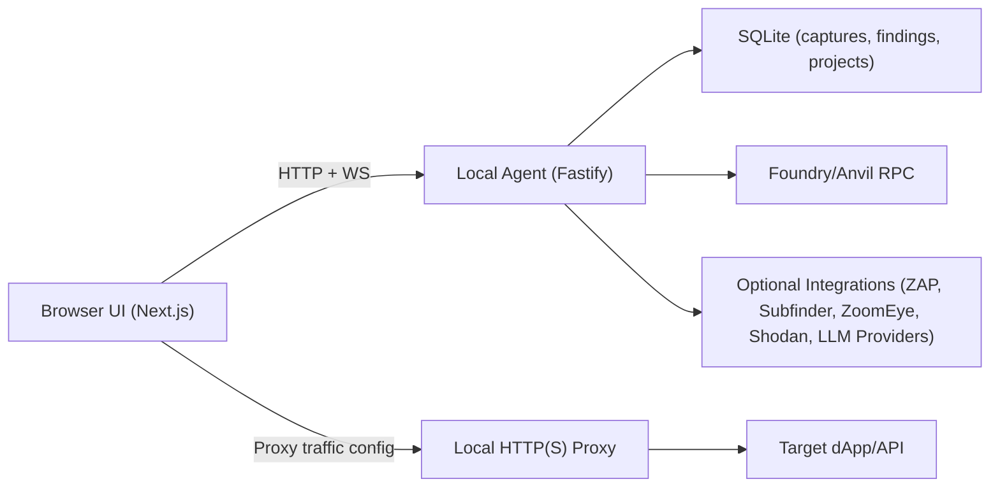

# CipherScope (`burp-crypto`)

CipherScope is a local-first security workbench for crypto applications.
It combines a Burp-style proxy/capture pipeline with EVM sandbox tooling, scanner workflows, and an operator UI.

## Table of Contents

- [What This Repo Includes](#what-this-repo-includes)
- [Architecture](#architecture)
- [Feature Tour](#feature-tour)
- [Quick Start](#quick-start)
- [First Capture Walkthrough](#first-capture-walkthrough)
- [Environment Variables](#environment-variables)
- [Scripts](#scripts)
- [Agent API Surface](#agent-api-surface)
- [Data Storage](#data-storage)
- [Troubleshooting](#troubleshooting)
- [Status and Roadmap](#status-and-roadmap)

## What This Repo Includes

This is a pnpm monorepo:

```text
apps/
  ui/         Next.js 16 app router UI (workbenches + local API routes)
  agent/      Fastify HTTP/WS backend, proxy engine, persistence, integrations
packages/
  proto/      Shared Zod schemas + TypeScript contracts
  sdk/        Typed client used by UI and tests
```

## Architecture



Core behavior:

- UI talks to the local agent only.
- Agent provides HTTP + WebSocket APIs.
- Proxy capture is durable (SQLite).
- HTTPS and `wss://` decryption is supported through local CA MITM.

## Feature Tour

Primary workbenches in the UI:

| Route        | Module             | Purpose                                                     |
| ------------ | ------------------ | ----------------------------------------------------------- |
| `/proxy`     | Proxy              | Intercept on/off, queue controls, CA download, smoke tests  |
| `/history`   | History            | HTTP and RPC history browsing, search, detail views         |
| `/repeater`  | HTTP Repeater      | Replay captured requests with overrides                     |
| `/`          | Contract Sandbox   | Simulate/execute contract calls using wallet or Foundry RPC |
| `/inspector` | Contract Inspector | ABI management and decoded contract interaction review      |
| `/explorer`  | DEX Explorer       | Protocol/pool exploration and contract discovery            |
| `/zoomeye`   | Host Search        | ZoomEye + Shodan search workflows                           |
| `/scanner`   | Scanner            | Passive checks and guarded active probes                    |
| `/audit`     | Security Audit     | Findings board with lifecycle status                        |
| `/report`    | Report Builder     | Build and export security reports (JSON/HTML)               |
| `/gas`       | Gas Profiler       | Trace-driven gas analysis for transactions                  |
| `/fuzzer`    | Fuzzer             | Run mutation campaigns against captured traffic             |
| `/settings`  | Settings           | Foundry, proxy, AI, case/project controls                   |

Notable backend capabilities:

- Local HTTP proxy with CONNECT tunneling, intercept queue, and MITM cert generation.
- WebSocket capture for `ws://` and `wss://` sessions.
- Project/session management with import/export as zip case files.
- Foundry/Anvil lifecycle support (status, RPC passthrough, snapshot/revert).
- Scanner, fuzzer, contract audit, and AI chat endpoints.
- Optional integrations for ZAP, Subfinder, ZoomEye, Shodan, Sourcify, and model providers.

## Quick Start

### Prerequisites

- Node.js `22+` (required for `node:sqlite` usage in the agent)
- `pnpm` `10+`
- Optional:
  - `anvil` (Foundry) for local EVM sandbox workflows
  - OWASP ZAP for ZAP scanning endpoints
  - `subfinder` for subdomain enumeration

### Install and Run

```bash
pnpm install
cp .env.example .env
pnpm dev
```

Open:

- UI: [http://localhost:3000](http://localhost:3000)
- Agent health: [http://127.0.0.1:17400/health](http://127.0.0.1:17400/health)

Default ports:

- Agent API: `127.0.0.1:17400`
- Proxy listener: `127.0.0.1:18080`
- Foundry RPC: `127.0.0.1:8545`

## First Capture Walkthrough

1. Start the app with `pnpm dev`.
2. Open `/proxy` and note the proxy listener (`127.0.0.1:18080` by default).
3. Configure your browser or system proxy to that host/port.
4. For HTTPS and `wss://` decryption, install the local CA from:

- `GET /tls/ca.der`
- `GET /tls/ca.pem`

5. Visit a target site and open `/history` to confirm captured traffic.
6. Open a message in `/repeater` to replay and compare variants.

## Environment Variables

Full reference: `[.env.example](./.env.example)`

High-impact variables:

| Area             | Variables                                                                                             |
| ---------------- | ----------------------------------------------------------------------------------------------------- |
| UI agent routing | `AGENT_HTTP_URL`, `NEXT_PUBLIC_AGENT_WS_URL`                                                          |
| Agent listener   | `AGENT_HOST`, `AGENT_PORT`                                                                            |
| Proxy listener   | `AGENT_PROXY_HOST`, `AGENT_PROXY_PORT`, `AGENT_MITM_ENABLED`, `AGENT_UPSTREAM_INSECURE`               |
| Persistence      | `AGENT_DB_PATH`, `LOG_LEVEL`                                                                          |
| Foundry/Anvil    | `AGENT_FOUNDRY_*`                                                                                     |
| AI provider      | `OPENAI_*`, `OPENROUTER_*`, `GEMINI_*`, `GROK_*`/`XAI_*`, `CLAUDE_*`/`ANTHROPIC_*`, `DEEPSEEK_*`      |
| AI safety gates  | `AGENT_AI_HTTP_ALLOW_ANY_HOST`, `AGENT_AI_ALLOW_RPC_SIDE_EFFECTS`                                     |
| Integrations     | `ZAP_API_URL`, `ZAP_API_KEY`, `SUBFINDER_*`, `ZOOMEYE_API_KEY`, `SHODAN_API_KEY`, `ETHERSCAN_API_KEY` |

Notes:

- The agent loads workspace `.env.local` and `.env` on startup.
- If you plan to use AI chat, configure at least one provider API key.

## Scripts

From repository root:

| Command          | Purpose                                                                       |
| ---------------- | ----------------------------------------------------------------------------- |
| `pnpm dev`       | Build shared packages, then run agent + UI concurrently                       |
| `pnpm start`     | Ensure build artifacts exist, start agent + production UI, and open localhost |
| `pnpm build`     | Build shared packages and UI                                                  |
| `pnpm test`      | Build shared packages and run test suites                                     |
| `pnpm lint`      | Run workspace lint tasks                                                      |
| `pnpm typecheck` | Run workspace type checks                                                     |
| `pnpm format`    | Run Prettier across repo                                                      |

Run a single app/package:

```bash
pnpm --filter @cipherscope/agent dev
pnpm --filter @cipherscope/ui dev
pnpm --filter @cipherscope/agent test
pnpm --filter @cipherscope/proto test
```

## Agent API Surface

Base URL (default): `http://127.0.0.1:17400`

### Health and Metrics

```text
GET    /health
GET    /metrics
GET    /events  (WebSocket)
```

### Projects and Case Files

```text
GET    /projects
POST   /projects
POST   /projects/current
GET    /projects/export
POST   /projects/import
GET    /case/export
POST   /case/import
```

### Proxy and Capture

```text
GET    /proxy/status
POST   /proxy/intercept
GET    /proxy/ignore-hosts
POST   /proxy/ignore-hosts
POST   /proxy/smoke
GET    /proxy/queue
POST   /proxy/queue/:id/forward
POST   /proxy/queue/:id/drop
GET    /tls/ca.pem
GET    /tls/ca.der
```

### Traffic and Replay

```text
GET    /messages
GET    /messages/:id
DELETE /messages/:id
GET    /sitemap
GET    /ws/connections
GET    /ws/:id/frames
POST   /replay
POST   /replay/batch
```

### EVM and RPC

```text
GET    /evm/status
GET    /evm/config
POST   /evm/config
DELETE /evm/config
POST   /evm/rpc
POST   /evm/snapshot
POST   /evm/revert
POST   /rpc/interactions
GET    /rpc/interactions
GET    /rpc/interactions/:id
```

### Contracts, Scanner, Fuzzer, Findings

```text
GET    /contracts
GET    /contracts/:id
POST   /contracts
GET    /contracts/decoded
DELETE /contracts/:id
POST   /scanner/run
GET    /scanner/findings
POST   /fuzzer/campaign
POST   /audit/contracts/run
GET    /findings
POST   /findings
PATCH  /findings/:id
```

### External Intelligence and AI

```text
GET    /explorer
GET    /zoomeye/hosts
GET    /shodan/hosts
GET    /shodan/searches
GET    /shodan/searches/:id
POST   /zap/scans/start
GET    /zap/scans
GET    /zap/scans/:id
POST   /zap/scans/:id/stop
POST   /subfinder/run
POST   /ai/chat
POST   /ai/retrieve
```

## Data Storage

Default durable data path:

- `./apps/agent/.data/cipherscope.db`

Additional generated assets:

- `./apps/agent/.data/projects/` (project index + per-project DBs)
- `./apps/agent/.data/tls/` (local CA and generated cert material)

Core tables include:

- `http_messages`
- `ws_connections`
- `ws_frames`
- `rpc_interactions`
- `findings`
- `contract_abis`
- `zap_scans`
- `ai_shodan_searches`

## Troubleshooting

### No traffic appears in History

- Confirm browser/system proxy is set to `127.0.0.1:18080` (or your configured proxy port).
- Verify agent is healthy at `/health`.
- Check intercept mode; requests will pause when intercept is enabled.

### HTTPS traffic is not decrypted

- Install and trust local CA from `/tls/ca.der` (or `/tls/ca.pem`).
- Restart the browser after trust changes.

### Foundry errors (`/evm/*`)

- Ensure `anvil` is installed and available in `PATH`, or set `AGENT_FOUNDRY_BINARY`.
- If you do not need local EVM features, disable with `AGENT_FOUNDRY_ENABLED=0`.

### Optional integration errors (ZAP/Subfinder/OSINT)

- Verify external dependency is installed/running and related env vars are set.
- For ZAP, check `ZAP_API_URL`/`ZAP_API_KEY`.
- For Subfinder, check `SUBFINDER_BINARY` and command availability.

## Status and Roadmap

Implemented:

- Monorepo foundation with shared contracts/sdk
- Proxy capture engine with intercept and TLS MITM
- Durable SQLite storage for HTTP/WS/RPC/findings
- Repeater, scanner, fuzzer, audit board, report builder, and EVM sandbox UI
- Project/case import-export workflows

In progress / planned:

- Deeper AI retrieval and autonomous workflows
- Additional scanner/fuzzer depth and workflow polish
- Expanded setup UX and cross-platform proxy ergonomics
